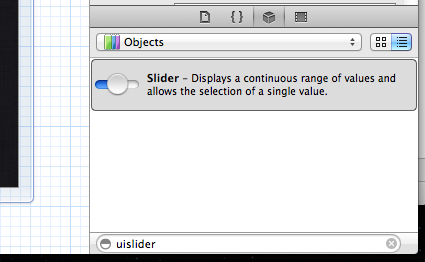
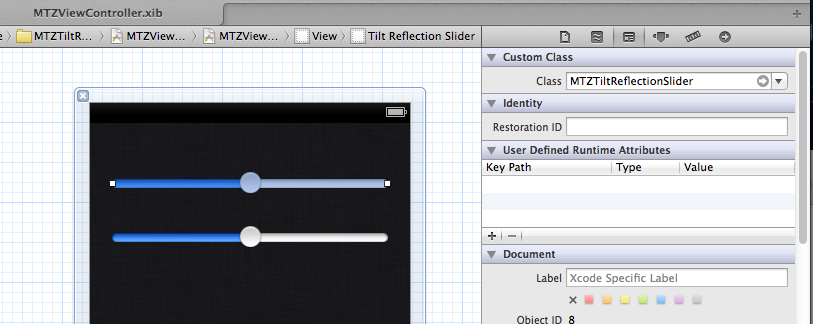

#MTZTiltReflectionSlider

A `UISlider` subclass mimicking and improving the tilt controlled slider added to Music.app in iOS 6

The knob changes it's lighting reflection based on the motion of the device.

Examples:

================================

#How To Use:

You can add this UI element programmatically or with Interface Builder.

I show how to add this in Interface Builder in steps 1 and 2.

1. Drag a `UISlider` from the Object Library (bottom part of Utilities panel).

2. Change class from default to custom class `MTZTiltReflectionSlider`.

3. Add the CoreMotion Framework to your project

4. Be sure to `#import "MTZTiltReflectionSlider.h"` in your UIViewController subclass

5. Set the size of the knob

	Small: 32px (`MTZTiltReflectionSliderSizeSmall`)

	Regular: 48px (`MTZTiltReflectionSliderSizeRegular`)
	
		[_mySlider setSize:MTZTiltReflectionSliderSizeSmall]
	
	If no size is set, it defaults to regular size (48px)
	
6. Tell the slider to start motion updates when needed and stop when not needed
	
	In your UIViewController subclass:
		
		- (void)viewWillAppear:(BOOL)animated
		{
			[_mySlider startMotionDetection];
		}

		- (void)viewWillDisappear:(BOOL)animated
		{
			[_mySlider stopMotionDetection];
		}